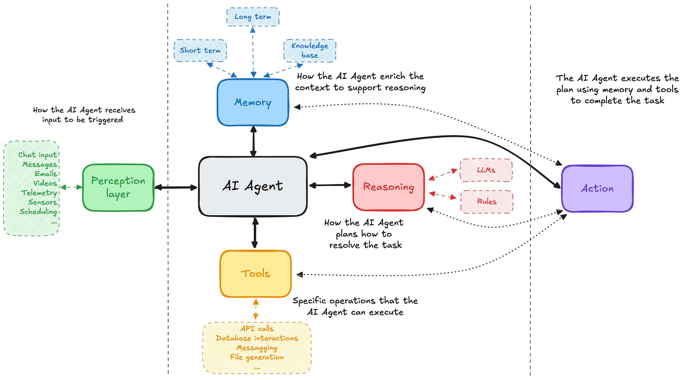

# Introduction to Agentic AI



## What is Agentic AI?

An AI Agent is a system that can:

- Understand goals
- Reason about tasks
- Use tools
- Maintain memory
- Perform actions

to accomplish objectives autonomously.

---

# Agent Formula

```text
Agent
=
LLM
+
Reasoning
+
Tools
+
Memory
+
Actions
```

---

# LLM vs Agent

## LLM

User:

```text
Find AI internships.
```

Response:

```text
You can search LinkedIn or Internshala.
```

The LLM only provides information.

---

## Agent

User:

```text
Find AI internships.
```

Agent:

```text
Search websites
↓
Collect openings
↓
Filter results
↓
Generate report
```

The agent performs actions.

---

# Core Components of an Agent

## 1. Brain (LLM)

Responsible for:

- Understanding
- Planning
- Reasoning

Examples:

- GPT
- Claude
- Gemini

---

## 2. Tools

Tools allow interaction with the outside world.

Examples:

```python
search_web()
weather_api()
calculator()
database_query()
```

Without tools, agents cannot act.

---

## 3. Memory

Memory stores information.

### Short-Term Memory

Current conversation context.

Example:

```text
User: My favorite language is Python.
```

---

### Long-Term Memory

Stored across sessions.

Example:

```text
User is interested in Agentic AI.
```

---

## 4. Actions

Actions change the environment.

Examples:

- Sending emails
- Updating spreadsheets
- Booking meetings
- Creating reports

---

# Agent Lifecycle

Every agent follows a loop.

```text
Observe
↓
Think
↓
Plan
↓
Act
↓
Observe Again
```

---

## Example

User:

```text
Find ML internships.
```

Observe:

```text
Need internship information.
```

Think:

```text
Need internet access.
```

Plan:

```text
Search
↓
Filter
↓
Summarize
```

Act:

```python
search_web()
```

Return result.

---

# ReAct Framework

One of the most important concepts in Agentic AI.

ReAct stands for:

```text
Reason + Act
```

---

## Example

Question:

```text
What is the weather today?
```

Agent:

```text
Thought:
Need weather information.

Action:
Call weather API.

Observation:
31°C

Final Answer:
Current temperature is 31°C.
```

---

# Why ReAct Matters

Traditional LLM:

```text
Question
↓
Answer
```

Agent:

```text
Question
↓
Reason
↓
Action
↓
Observation
↓
Answer
```

This enables dynamic problem solving.

---

# Simple Agent Example

```python
def search_tool():
    return "Found 10 AI internships"

query = input("Enter Query: ")

if "internship" in query.lower():

    print("THOUGHT: Need search tool")

    result = search_tool()

    print("ACTION:", result)

else:
    print("Direct response")
```

---

# Difference Between LLM and Agent

| LLM | Agent |
|------|------|
| Generates text | Performs actions |
| No tools | Uses tools |
| No memory | Can store memory |
| Single-step response | Multi-step reasoning |
| Reactive | Goal-oriented |

---

# Key Takeaways

- Agentic AI extends LLMs with tools, memory, and actions.
- Agents are goal-oriented systems.
- ReAct is the foundation of most modern agents.
- Every agent follows the Observe → Think → Plan → Act loop.

---

# Next Topic

How LLMs Work Internally

- Tokens
- Embeddings
- Transformers
- Attention Mechanism
- Context Windows