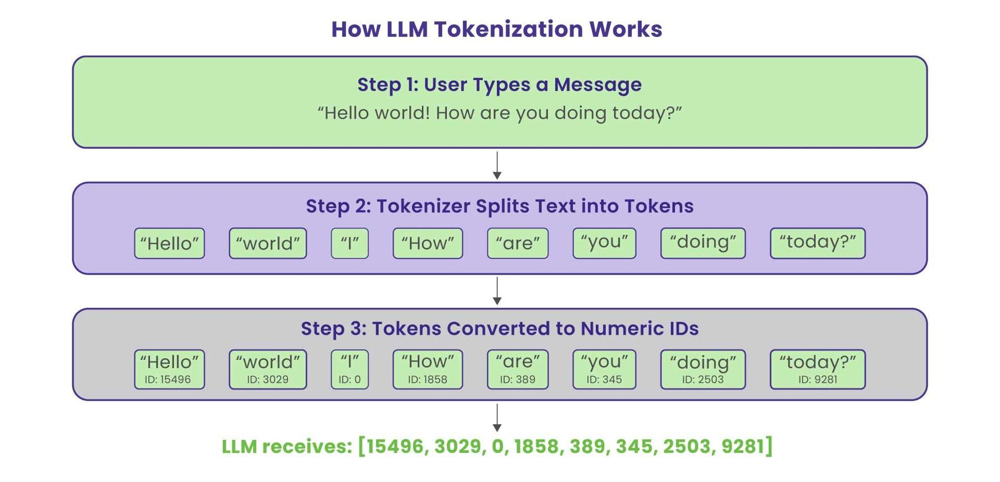
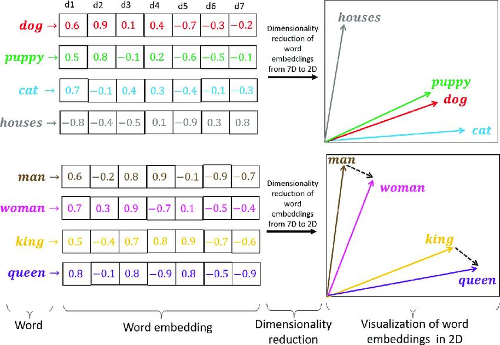
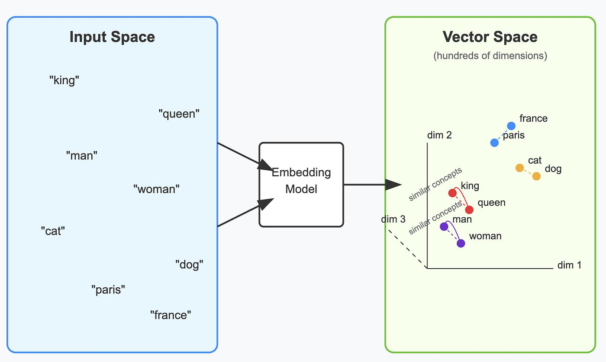

# Tokens

In this module, we're going to discuss **Tokens**, **Token IDs**, **Embeddings**, and the **Context Window**.

Tokens are chunks of text. One important thing to understand is that **tokens and words are not always the same**. In LLMs, text is first broken down into smaller pieces called tokens.

### Example

```text
Hello World
```

may become:

```python
["Hello", "World"]
```

But:

```text
unbelievable
```

might become:

```python
["un", "believ", "able"]
```

This is called **Subword Tokenization**.

Similarly:

```text
ChatGPT
```

might become:

```python
["Chat", "G", "PT"]
```

Models use subword tokenization because they can learn patterns more efficiently than memorizing entire words.

> The model never sees the original sentence directly. It only sees tokens.



---

# Token IDs and Embeddings

Computers cannot understand text or tokens directly, so tokens are converted into numbers called **Token IDs**.

These IDs act as unique identifiers for tokens.

For example:

```text
cat = 51
dog = 84
```

The computer initially sees only these IDs.

However, Token IDs alone do not capture the meaning or similarity between words.

For example:

```text
cat = 51
dog = 84
```

Looking at the IDs, there is no indication that cats and dogs are related.

This is where **Embeddings** come in.

Embeddings are vector representations of tokens that capture their semantic meaning.

Words with similar meanings tend to have similar embeddings, while unrelated words are farther apart.

Example:

```text
Cat
[0.2, 0.8, 0.1, 0.7]

Dog
[0.3, 0.7, 0.2, 0.8]

Car
[0.9, 0.1, 0.8, 0.2]
```

Notice that:

```text
Cat ≈ Dog
```

The vectors are similar.

This means the model can learn that cats and dogs are more closely related than cats and cars.

> Embeddings are numerical representations of meaning.





---

# Context Window

A **Context Window** can be thought of as the model's **working memory**.

It contains the tokens from the current conversation that the model can see and use while generating responses.

Imagine I tell you:

> My name is Mekha.

Then, a few minutes later, I ask:

> What's my name?

Why can ChatGPT answer?

Because both messages still fit inside its context window.

```text
Token 1
Token 2
Token 3
...
Token 128000
```

The model can look at all of these tokens while generating a response.

> Context Window = Current Conversation Memory

### Important Note

The context window is **not long-term memory**.

It only contains information that is currently available within the conversation. If information falls outside the context window, the model can no longer see it.

So far, the flow is:

```text
Text
  ↓
Tokens
  ↓
Token IDs
  ↓
Embeddings
  ↓
Context Window
```

