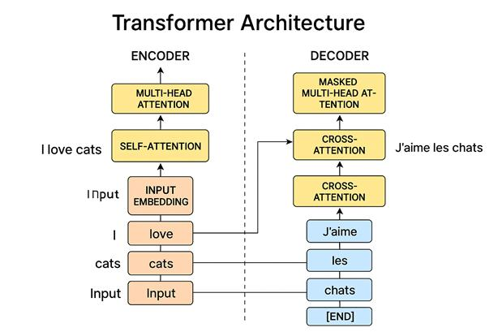

# Transformer

The Transformer model changed the AI world forever.

In 2017, the paper **"Attention Is All You Need"** introduced the Transformer architecture. Before Transformers, models like **RNNs (Recurrent Neural Networks)** and **LSTMs (Long Short-Term Memory Networks)** were commonly used for processing sequential data.

The core idea behind Transformers is simple but powerful:

> Instead of processing words one by one, the model looks at all words in a sentence at the same time.

This allows the model to understand relationships between words more effectively and makes training much faster.




---

# Attention

Imagine reading the sentence:

> I went to the bank to deposit money.

When the model encounters the word **"bank"**, it asks:

> Which words should I pay attention to in order to understand the meaning of "bank"?

The attention scores might look like this:

| Word    | Attention Score |
| ------- | --------------- |
| deposit | 0.50            |
| money   | 0.40            |
| went    | 0.05            |
| I       | 0.05            |

Since the words **deposit** and **money** are highly related to banking, the model understands that **bank** refers to a financial institution rather than a river bank.

This mechanism is called **Attention**.

---

# Self-Attention

Self-Attention is the core building block of a Transformer.

In Self-Attention, every word looks at every other word in the sentence to understand its context.

Consider the sentence:

> The cat drank milk because it was hungry.

Humans immediately understand that **"it"** refers to the **cat**.

But how does a machine understand that?

This is where Self-Attention comes into play.

The model assigns higher attention scores to words that are more relevant to the current word. In this case, the word **"it"** will pay more attention to **"cat"** than to **"milk"**, helping the model understand that:

> it = cat

---

# How Self-Attention Works

For every token (word), the model creates three vectors:

### Query (Q)

What am I looking for?

### Key (K)

What information do I contain?

### Value (V)

What information should I pass?

For example, the words:

```text
cat
milk
hungry
```

are converted into:

```text
Q, K, V
```

vectors.

The model then compares:

```text
Query × Key
```

to calculate how important one word is to another.

* Higher score → More attention
* Lower score → Less attention

After calculating these scores, the model combines the corresponding **Value vectors** using those attention weights.

This process allows the model to understand relationships between words and capture context effectively.

---

# Multi-Head Attention

One attention mechanism is often not enough.

Different attention heads can learn different types of relationships:

* Grammar relationships
* Subject–object relationships
* Semantic meaning
* Long-range dependencies

This is called **Multi-Head Attention**.

Think of it as multiple experts analyzing the same sentence from different perspectives and then combining their insights.

---

# Final Thoughts

Transformers are the foundation of modern AI systems such as GPT, ChatGPT, Gemini, Claude, and Llama.

There is still a lot more to learn about Transformers, including:

* Positional Encoding
* Encoder vs Decoder
* Multi-Head Attention in detail
* BERT vs GPT
* Training and Fine-Tuning

If you're interested in diving deeper, check out the original paper:

**Attention Is All You Need**
https://proceedings.neurips.cc/paper_files/paper/2017/file/3f5ee243547dee91fbd053c1c4a845aa-Paper.pdf

I'll be honest—I don't fully understand every detail of the paper yet either. It's a challenging read, but it's one of the most important papers in modern AI and definitely worth exploring.
