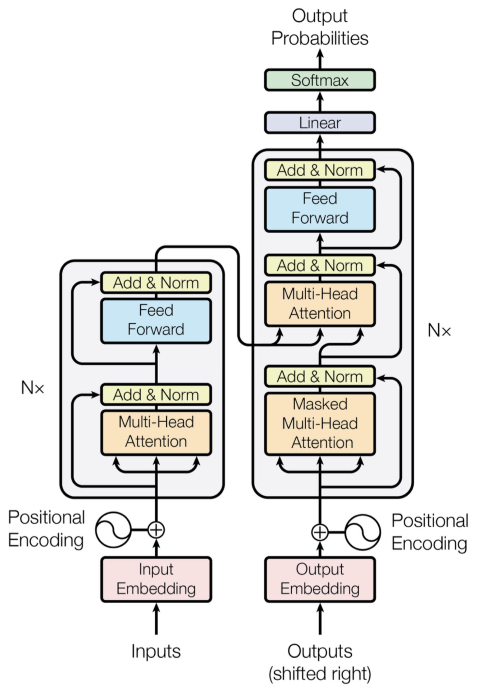

## Transformer
The transformer model changed ai world forever.
In 2017:Attention Is All You Need, introduced the Transformers.
Before RNN and LSTM were used.
The core idea of transformers is that to see all words at once instead seeing it one by one.

## Attention
Imagine reading:
I went to the bank to deposit money.
When the model sees: bank
It asks: Which words should I pay attention to?
Attention scores might be:
| Word    | Attention |
| ------- | --------- |
| deposit | 0.50      |
| money   | 0.40      |
| went    | 0.05      |
| I       | 0.05      |
Because:deposit + money ,it indicate a financial bank.

## Self-Attention
Every word looks at every other word.
eg : The cat drank milk because it was hungry.
how does the modle can know 'it' means the cat , its where the attention scores come int play

How Self-Attention Works:
Each token creates 3 vectors:

Query (Q)
What am I looking for?

Key (K)
What information do I contain?

Value (V)
What information should I pass?
cat
milk
hungry

Each word generates:
Q
K
V

The model compares: Query × Key to determine the importance.
Higer scores = more attention whereas lower score mean less attention , then what happens next? Then the weighted values are combined.

One attention mechanism isn't enough ,so we make use of multi attention mechanism

There is so much to learn about "TRANSFORMER", So if you are interested do checkout : https://proceedings.neurips.cc/paper_files/paper/2017/file/3f5ee243547dee91fbd053c1c4a845aa-Paper.pdf

It ain't easy to understand , even i don't but give it a try!

